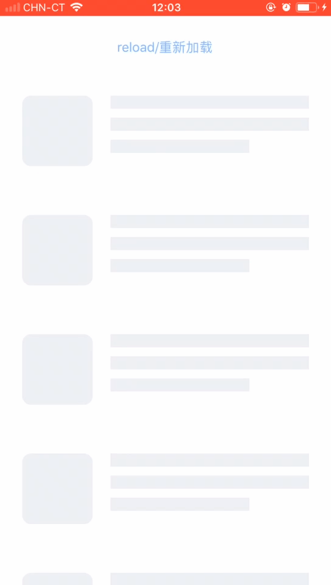

# Overview

As you can see, when using RxDataSources, we can not just use SkeletonView together, so I wrote this code to support for using SkeletonView with RxDataSources.

# Screenshot

  

# Usage

See demo project for details.
